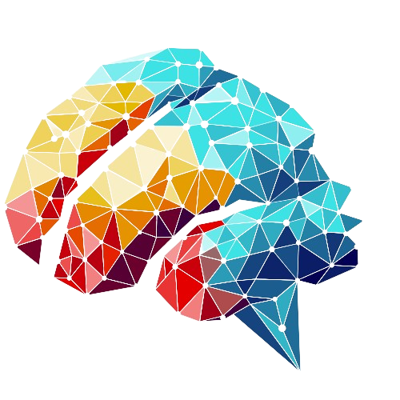

<p align="center">
  
</p>

<h1 align="center"><b>FraudGuard</b></h1>

---

# 📄 Product Requirements Document: FraudGuard

### **Vision & Mission** 💡

> **Vision:** To create the most trustworthy decentralized marketplace by empowering users and protecting creators with transparent, real-time, AI-driven fraud detection.

> **Mission (for this Hackathon):** To build a functional MVP of an on-chain marketplace on the Sui network that integrates an AI agent to detect and flag potential plagiarism and suspicious on-chain behavior, making this information visible to users directly on the frontend.

---

## Hackathon Recognition
🏆 **Champion: Best On-chain Marketplace Application __(SUI sponsored)__ — DEVMatch Blockchain Hackathon 2025 (APUBCC)**  

---

## **🧑‍💻 Target Audience**

1.  **NFT Creators/Artists:** Want to protect their original work from plagiarism and theft.
2.  **NFT Collectors/Traders:** Want to make informed purchasing decisions and avoid scams, fake assets, and manipulated prices.
3.  **Marketplace Operators:** (Future) Want to build a reputable platform with automated, decentralized moderation.

---

## **Core Features & User Stories (MVP Scope)**

### **1. On-Chain Marketplace (Sui)**
This is the decentralized foundation of the application.

* **User Story:** As a user, I can connect my Sui wallet to the marketplace.
* **User Story:** As a creator, I can mint an NFT and list it for sale on the marketplace smart contract.
* **User Story:** As a buyer, I can purchase a listed NFT, which transfers ownership to my wallet.
* **User Story:** As the AI Agent, I can call a specific function on the smart contract to attach a `FraudFlag` to a specific NFT object.

### **2. AI Fraud Detection Agent (Backend: FastAPI, LangChain + Google Gemini)**
This is the "brain" that monitors and acts on suspicious activity using advanced AI.

* **User Story (Visual AI with Gemini):** As the agent, when a new NFT is minted, I will use Google Gemini Pro Vision to analyze its image content, extract detailed descriptions, detect fraud indicators (plagiarism, AI-generation, low-effort content), and create vector embeddings using Google embeddings for similarity comparison.
* **User Story (Behavioral AI):** As the agent, I will monitor on-chain events for simple red flags, such as a single wallet minting an unusually high number of NFTs in a short period.
* **User Story (Enforcement):** As the agent, if I detect a high probability of fraud (either visual or behavioral), I will automatically sign and submit a transaction to the Sui network to flag the corresponding NFT object.

### 3. Multi-Agent Architecture
- **FraudFlag Enforcement** — Verified fraudulent actors are flagged and restricted from future marketplace participation.
- **RAG Agent** — Uses retrieval-augmented generation to reference a fraud knowledge base for context-aware detection.
- **Reputation & Enforcement Agent** — Maintains a reputation ledger, applies penalties, and automates DAO decisions.
- **Price Predictor Agent** — Runs statistical and ML-based price validation for marketplace listings.

### 4. Security Layer — Warlus & Seal Integration
- **Warlus** — High-performance cryptographic proofs for fraud verification without revealing sensitive data.
- **Seal** — Privacy-preserving computations for fraud detection.

### **5. Marketplace Frontend (Vite with React)****
This is the user-facing window into the marketplace.

* **User Story:** As a user, I can browse all NFTs listed on the marketplace.
* **User Story:** As a user, when I view an NFT that has been flagged by the AI Agent, I will see a clear and prominent warning message (e.g., "⚠️ High Plagiarism Risk Detected" or "⚠️ Suspicious Minting Activity Detected").
* **User Story:** As a user, the warning will not prevent me from buying, but it will allow me to make a more informed decision.

---

## **⚙️ Tech Stack**

| Component | Technology | Purpose |
| :--- | :--- | :--- |
| **Blockchain** | **Sui (Move)** | For creating the smart contracts that govern the marketplace, NFTs, and the on-chain `FraudFlag` objects. The object-centric model is perfect for this. |
| **Frontend** | **Vite & TypeScript** | To build a fast, user-friendly interface. Connects to the Sui network via wallet adapters (`@mysten/dapp-kit`) to read on-chain data and submit transactions. |
| **Backend API** | **FastAPI (Python)** | To serve as the communication hub. The frontend might call it for cached data, but its main job is to run the AI agent logic. |
| **AI Agent Logic**| **LangChain / LangGraph (Python)**| To structure the fraud detection flow. **LangGraph** is excellent for creating the stateful, multi-step agent that will: 1. See event, 2. Analyze, 3. Decide, 4. Act. |
| **Vector DB / Cache**| **Supabase (Postgres w/ pgvector)**| **This is crucial.** You need Supabase for: <br>1. **Vector Database**: Store image embeddings from NFTs and perform similarity searches for plagiarism detection. <br>2. **Cache**: Store wallet activity or other data to avoid spamming the Sui RPC endpoint. |
<!-- | **Deployment** | **Vercel** (Frontend), **Render/Railway** (Backend)| For easy and fast deployment during the hackathon. | -->

### **Why Supabase is needed:**
Your AI agent can't scan the *entire blockchain* for every new image. Instead, when a new NFT is minted, the agent's process will be:
1.  Take the NFT's image URL.
2.  Convert the image to a vector embedding using a model like CLIP.
3.  **Query Supabase:** "Find any vectors in my database that are highly similar to this new vector."
4.  If a match is found, flag for plagiarism.
5.  **Insert into Supabase:** Store the new, non-plagiarized image's vector for future checks.

---
Follow these steps:

```sh
# Step 1: Clone the repository using the project's Git URL.
git clone <YOUR_GIT_URL>

# Step 2: Navigate to the project directory.
cd <YOUR_PROJECT_NAME>

# Step 3: Install the necessary dependencies.
npm i

# Step 4: Start the development server with auto-reloading and an instant preview.
npm run dev
```

## 🚀 New: Google Gemini-Powered Fraud Detection

FraudGuard now uses **Google Gemini Pro Vision** for advanced AI-powered fraud detection:

### Key Features:
- **🔒 Slush**: Utilizes zkLogin to enable secure, passwordless authentication using existing Web2 identities, ensuring user privacy while seamlessly integrating with the decentralized marketplace
- **🔍 Advanced Image Analysis**: Gemini Pro Vision analyzes NFT images for fraud indicators
- **📝 Smart Description Extraction**: Automatic detailed description generation for semantic analysis  
- **🧠 AI Fraud Detection**: Detects plagiarism, AI-generation, template usage, and low-effort content
- **🤖 Enhanced RAG AI agent**: Intelligently analyzes user queries and returns refined LLM responses by dynamically referencing either local documentation (for relevant on-chain/project data) or performing live web searches via the Tavily agent
- **👂🏻 Reputation score AI agent**: Continuously evaluates user actions in real time to calculate dynamic reputation scores, automatically restricting or banning low-trust users to safeguard the marketplace ecosystem
- **💻 Price predictor**: Uses machine learning to estimate the optimal minting price for an NFT based on its attributes, metadata, and market trends.
- **🔗 Vector Similarity Search**: 768-dimensional Google embeddings for precise duplicate detection
- **⚡ Intelligent Workflow**: LangGraph orchestrates multi-step fraud analysis pipeline

### Quick Start with Gemini:
```bash
# 1. Set up environment
cp backend/.env.example backend/.env
# Add your GOOGLE_API_KEY to .env

# 2. Install dependencies  
cd backend
pip install -r requirements.txt

# 3. Test the fraud detection
python test_fraud_detection.py

# 4. Start the API server
uvicorn main:app --reload
```

### Documentation:
- **[Complete Workflow Guide](documentation/GEMINI_WORKFLOW_GUIDE.md)**: Detailed technical documentation
- **[API Reference](backend/main.py)**: FastAPI endpoints and models
- **[Configuration Guide](backend/.env.example)**: Environment setup

Experience the future of NFT fraud prevention with AI! 🛡️✨

